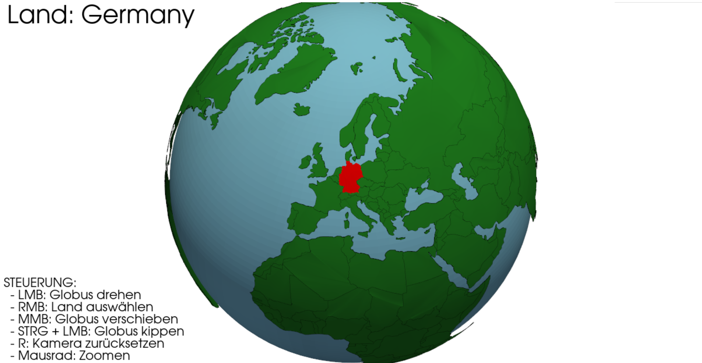

# 🌍 Interaktiver 3D-Globus

## Project Title

**Interaktiver 3D-Globus mit Länder-Selektion**

## Brief Description

Dieses Projekt visualisiert die Erde als interaktiven 3D-Globus. Länder können per Mausklick ausgewählt und hervorgehoben werden. Ziel ist eine anschauliche und interaktive Darstellung globaler Geodaten.

---

## Features

* Interaktiver 3D-Globus (Drehen, Zoomen, Verschieben)
* Darstellung aller Länder der Erde
* Auswahl eines Landes per Rechtsklick
* Rote Hervorhebung des ausgewählten Landes
* Anzeige des Ländernamens im Viewport

Interessante Aspekte:
* Projektion von 2D-Geodaten auf einer 3D-Kugel
* Schnelle Länder-Erkennung durch räumlichen Suchindex

---

## Technologies Used

## Python Libraries

* **Python 3**
* **PyVista** – 3D-Visualisierung
* **NumPy** – numerische Berechnungen
* **SciPy (optional)** – KD-Tree für schnelle Suche
* **Matplotlib (Path)** – Punkt-in-Polygon-Tests

---

## Techniken

* Kugelprojektion (Lon/Lat → 3D)
* KD-Tree-basierte Klick-Erkennung
* Polygon-Triangulation und Subdivision

---

## Installation & Setup

cd final-assignment/Heide/Heide_Lino_Abschlussprojekt.py
pip install -r requirements.txt

---

## Usage

python Heide_Lino_Abschlussprojekt.py

---

## Data

* Verwendet Natural Earth – Admin 0 Countries (110m)
* Datenformat: GeoJSON
* Automatischer Download beim ersten Start
* Optional: Lokaler Cache:

    ~/.globus_cache/laender.geojson

---

## Implementation Details

* Länder bestehen aus Polygon- und MultiPolygon-Geometrien
* Grenzen und Innenflächen werden mit Punkten gesampelt
* Alle Punkte werden auf die Kugeloberfläche projiziert
* KD-Tree ermöglicht schnelle Zuordnung eines Klicks zu einem Land

**Herausforderungen:**

* 2D auf 3D
* Präzises Picking bei beweglicher Kamera
* Projektion komplexer Multi-Polygone

**Performance:**

* Verwendung eines 110m-Datensatzes
* Räumlicher Index statt Ray-Casting

---

## Screenshots

* Gesamtansicht des Globus
* Hervorgehobenes Land

---

## Future Improvements (optional)

* GUI-Suchfeld für Länder
* Zusätzliche Metadaten pro Land
* Höher aufgelöste Geodaten
* Animierte Kamerafahrten
* Implementierung von Hauptstädten

Autor: Lino Heide
